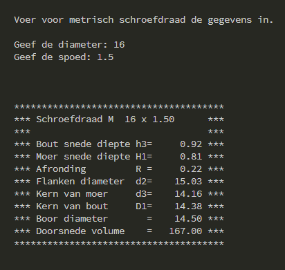

## Metrisch_schroefdraad
Simple little program that provides information on Metric threads for CNC machining (in the Dutch language).

## Motivation
I needed this tool in my workshop to quickly find information about threads instead of looking up in the Machinery's Handbook or on the internet.

## Build status

## Code style

 
## Screenshots

## Tech/framework used
Ex. -

<b>Built with</b>
- [Python](https://www.python.org/)

## Features
What makes your project stand out?

## Code Example
Show what the library does as concisely as possible, developers should be able to figure out **how** your project solves their problem by looking at the code example. Make sure the API you are showing off is obvious, and that your code is short and concise.

## Installation
Provide step by step series of examples and explanations about how to get a development env running.

## Tests
Describe and show how to run the tests with code examples.

## How to use?
The program is simple start Metrisch_schroefdraad.py it will ask you for 2 variables and then give you the information back.

## Contribute

## Credits
Give proper credits. This could be a link to any repo which inspired you to build this project, any blogposts or links to people who contrbuted in this project. 

#### Anything else that seems useful

## License
GNU General Public License v3.0
